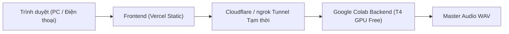

# 13 — HƯỚNG DẪN TRIỂN KHAI & KẾT NỐI TỪ XA (PHASE 13)

## 1. Nguyên Tắc Cốt Lõi Về Hạ Tầng 0 Đồng
Theo đúng quy định tại [docs/08_FREE_INFRA.md](file:///C:/Users/ADMIN/Desktop/LAPQUE_TTS_VIETNAMESE_ANTIGRAVITY/LAPQUE_TTS_VIETNAMESE_ANTIGRAVITY/docs/08_FREE_INFRA.md):
- **Vercel** chỉ dùng để host giao diện người dùng (Static Web UI / Orchestration).
- **Không chạy GPU inference trên Vercel** (Vercel serverless không có GPU và giới hạn thời gian chạy 10–60s).
- **GPU Backend:** Chạy trực tiếp trên máy cục bộ (Localhost) hoặc Google Colab Free Tier (T4 GPU).

---

## 2. Kịch Bản 1: Chạy Cục Bộ Hoàn Toàn (Khuyến Nghị Cho 1 Người Dùng)
Khởi chạy máy chủ FastAPI trên máy tính cá nhân:
```bash
uvicorn backend.app.main:app --reload --host 127.0.0.1 --port 8000
```
Mở trình duyệt truy cập: `http://127.0.0.1:8000`

---

## 3. Kịch Bản 2: Truy Cập Giao Diện Từ Xa (Vercel + Colab Tunnel 0 Đồng)



### Các bước thiết lập:
1. **Triển khai Frontend lên Vercel:**
   - Kết nối repository với Vercel.
   - Thư mục gốc (Root directory): `frontend/`.
   - Vercel sẽ phục vụ giao diện tĩnh tức thì qua URL `https://your-project.vercel.app`.
2. **Mở cổng kết nối Colab tạm thời:**
   - Khi chạy notebook trên Colab, sử dụng Cloudflare Tunnel hoặc ngrok miễn phí để tạo URL HTTPS tạm thời.
   - Dán URL tạm thời vào cấu hình API của Web Studio.
   - Sau khi hoàn thành phiên làm việc, tắt phiên Colab để bảo vệ tài nguyên miễn phí.

---

## 4. Bảo Mật & Quyền Riêng Tư
1. **Không commit secret:** Tuyệt đối không nhúng token hoặc khóa bí mật vào mã nguồn client.
2. **URL tạm thời:** Coi mọi URL tunnel là tạm thời, tự động hủy sau mỗi phiên tổng hợp.
3. **Quyền sở hữu:** Toàn bộ file âm thanh và giọng mẫu được lưu trữ trên ổ đĩa / Google Drive cá nhân của bạn.
